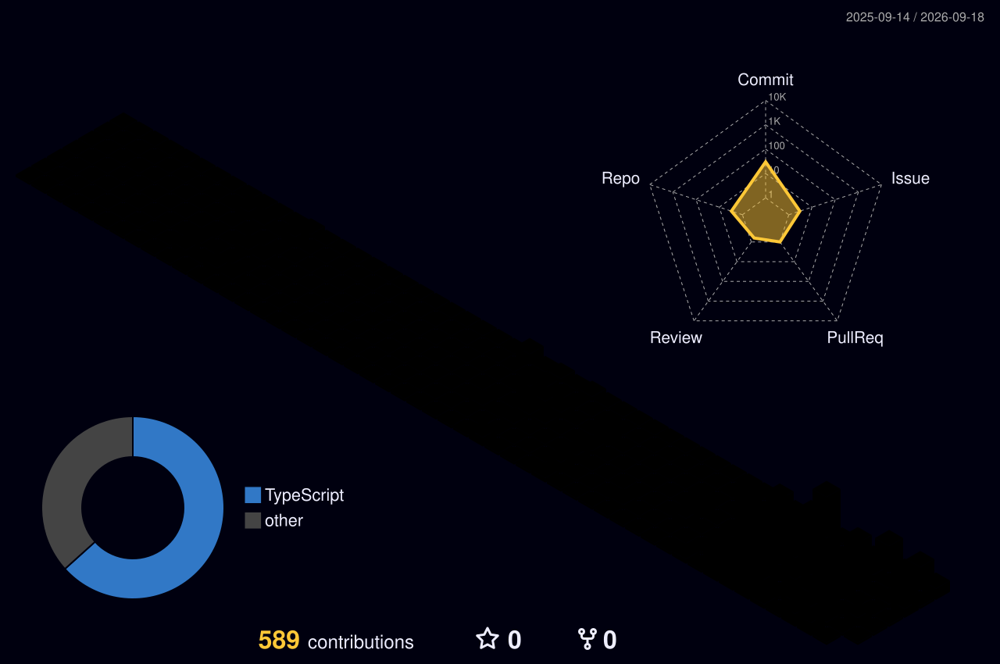

<!-- PALETTE: bg #0D0221 | cyan #00F0FF | magenta #FF2A6D | yellow #F9F002 | purple #2D1B4E -->


<div align="center">

[](https://git.io/typing-svg)

</div>

```ansi
$ whoami
ZetvD (minzinccs)
$ cat focus.txt
[>] self-hosting + system integrations
[>] minecraft server engineering
[>] VPN architectures + custom web dashboards
$ status ● online — building in the neon terminal_
```

---

<!-- THEME: cyberpunk-retro // TECH STACK v2 table layout -->
## ⚡ TECH_STACK

| SYSTEM // MODULE | ARSENAL |
| :---: | :--- |
| **LANGUAGES** |      |
| **BACKEND & FRONTEND** |     |
| **INFRA & GAME SERVERS** |     |
| **NETWORK & DATA** |     |

---

<!-- THEME: tokyonight + bg #0D0221 // STATS neon grid mix -->
## 📊 STATS // NEON_GRID

<div align="center">
  
  
</div>

<div align="center">
  
</div>

<div align="center">
  
</div>

<div align="center">
  
</div>

---

## 🚀 FEATURED_BUILDS

<!-- local builds, not yet public on GitHub — no dead links -->

| PROJECT | DESCRIPTION | STACK |
|---|---|---|
| **MC-Host** `Zhosting` | Hosting billing platform — Pterodactyl automation, VietQR/MBBank checkout, admin + Docker | `React 19` `Express + TS` `Prisma` `MariaDB` `Redis` |
| **minecraft-panel-custom** | Custom game-server panel on Pterodactyl — isolated Docker containers | `PHP` `React` `Go` `Docker` |
| **mbbank-service** | Unofficial MBBank Python API — balance, history, transfers | `Python` `Docker` |
| **hermes-stack** | Docker self-hosting agent stack — socket-proxy + workspace agent | `Python` `Docker` |
| [**haru-manager**](https://github.com/minzinccs/haru-manager) | Image curation panel for Haru | `JavaScript` |

---

## ⚡ CURRENT_FOCUS // BOOT_SEQUENCE

```ansi
$ ./boot --mode=night-city --user=zetvd
> initializing neon-grid ............ OK
> loading vpn_architectures [███████████████-----] 78%
> deploying dashboards // fullstack [██████████----------] 52%
> current_quest: building + shipping daily
> side_process: game-server automation
> STATUS: ONLINE — open to collab
$ ./run --energy=cyberpunk --coffee=∞
```

---

<div align="center">

[](https://git.io/typing-svg)


</div>


